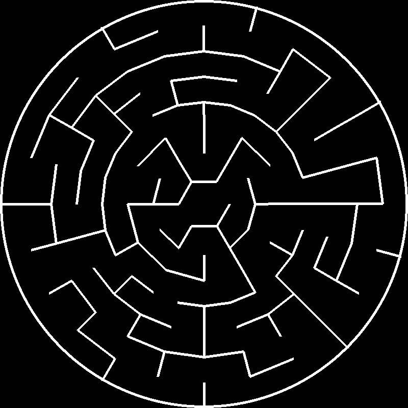

# Procedural-Maze-Generator-Algorithms

Check out my youtube channel : [Auctux](https://www.youtube.com/c/Auctux)

### Requirements
> ***PYGAME*** : pip install pygame

### Commands Controls:
- `Esc`   to close the program
- `Enter` to start to genrate the maze
- `H`     to show the heuristic cost value
- `S`     to show the path from the starting to the goal node
- `Space` to switch between the color modes

## files
 - run ***main.py***          for grid mazes
 - run ***polarMaze.py***     for polarGrid maze
 - run ***hexMaze.py***       for hexGrid maze
 - run ***imageMaze.py***     for maskGrid maze
 - run ***weightedMaze.py***  for weightedGrid maze

## colors modes
Mode 1 : 
Mode 2 : 

---
## other Maze Grid:
Polar Grid : 
HexGrid : 
maskGrid : 
---

## mazes
- Aldous Broder 
 
- Binary Tree 

- Eller's Algorithm 

- Growing Tree 

- Hunt And kill 

- Kruskal's algorithm 

- Prims Algorithm 

- Simplified Prims 

- Wilson algorithm 

- Sidewinder Algorithm 

- Recursive Backtracker 

