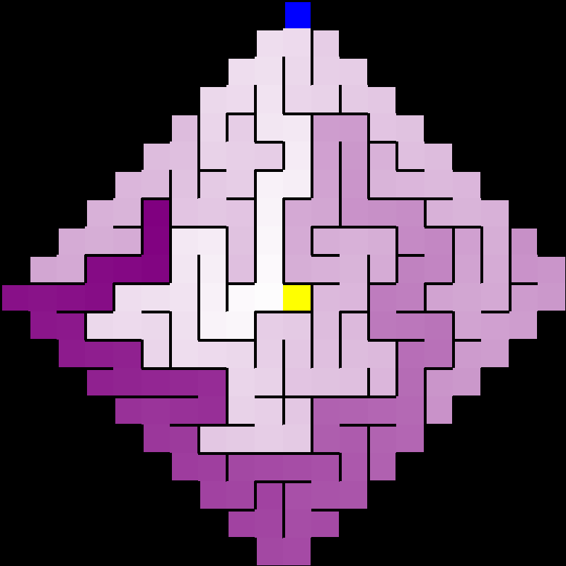
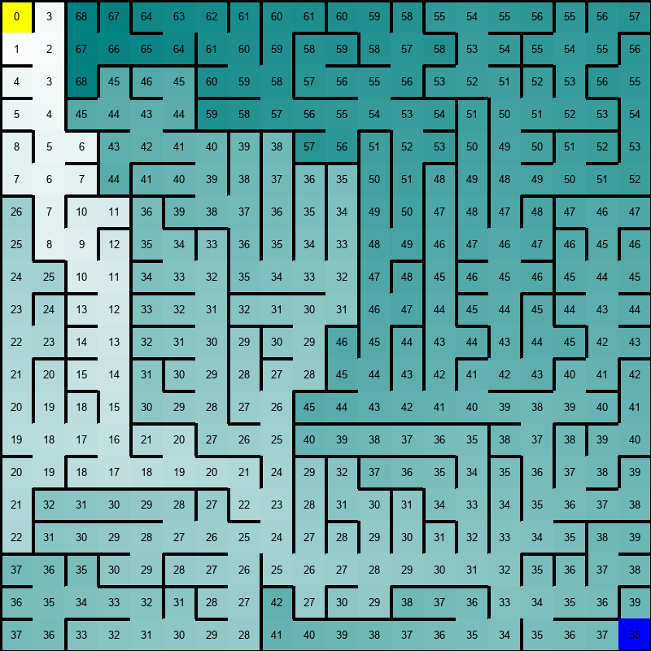

# Procedural-Maze-Generator-Algorithms

Check out my youtube channel : [Auctux](https://www.youtube.com/c/Auctux)

### Documentations
 - Thanks to Jamis Buck Book : [Mazes for programmers](https://www.amazon.in/gp/product/B013HA1UY4/ref=as_li_qf_asin_il_tl?ie=UTF8&tag=auctux-21&creative=24630&linkCode=as2&creativeASIN=B013HA1UY4&linkId=cd1ab49c7f656324511f624fefe1ecda)

### Requirements
> ***PYGAME*** : pip install pygame

### Commands Controls:
- `Esc`   to close the program
- `Enter` to start to genrate the maze
- `H`     to show the heuristic cost value
- `S`     to show the path from the starting to the goal node
- `Space` to switch between the color modes

## files
 - run ***main.py***          for grid mazes
 - run ***polarMaze.py***     for polarGrid maze
 - run ***hexMaze.py***       for hexGrid maze
 - run ***imageMaze.py***     for maskGrid maze
 - run ***weightedMaze.py***  for weightedGrid maze

 > you can also ***braid*** your mazes when it done , by calling the function `grid.Braid()`.
 ***braiding a maze*** simply assures that the maze doens't have any deadends
 
## colors modes
Mode 1 : 
Mode 2 : 

## other Maze Grid:
Polar Grid : 
HexGrid : 
maskGrid : 

## Show heuristic and path
- heuristic  : 
- showPath : 

## Bugs & Unsolved Issues
- The code need a lot of refactoring 
- the visualization of the polar maze need a lot of improvement 
- the the imagemaze.py file need to be refactored for it to be able to work on every size of images , for now it's only working for images wich has the same size with the screen size
- the recursive backtracker class need a little bit of cleaning
- add Comments
- implement the ui interface
- the djikistra algorithm need to take the weights of cells in consideration for weightedGrid
## mazes
---
```python:main.py
initialize:
 binary_tree = BinaryTree(Grid(rows, cols, cell_size), "GREEN")
 wilson = Wilson(Grid(rows, cols, cell_size), "PURPLE_E")
 side_winder = SideWinder(Grid(rows, cols, cell_size), "BLUE")
 hunt_and_kill = HuntAndKill(Grid(rows, cols, cell_size), "RED")
 aldous_broder = AldousBroder(Grid(rows, cols, cell_size), "GREEN")
 recursive_backtracker = RecursiveBacktracker(Grid(rows, cols, cell_size), "BLUE")
 kruskal = Kruskals(Kruskals.State(Grid(rows, cols, cell_size)))
 simplePrims = SimplePrims(Grid(rows, cols, cell_size), "CYAN")
 prims = Prims(Grid(rows, cols, cell_size))
 growingTree = GrowingTree(Grid(rows, cols, cell_size), "GREEN")
 ellers = Ellers(Grid(rows, cols, cell_size), 0, "RED")
mainloop():
 wilson.Generate(screen, show_text, color_mode, show_path)
 binary_tree.Generate(screen, show_text, color_mode, show_path)
 kruskal.Generate(screen, show_text, color_mode, show_path)
 side_winder.Generate(screen, show_text, color_mode, show_path)
 hunt_and_kill.Generate(screen, show_text, color_mode, show_path)
 aldous_broder.Generate(screen, show_text, color_mode, show_path)
 recursive_backtracker.Generate(screen, show_text, color_mode, show_path)
 simplePrims.Generate(screen, show_text, color_mode, show_path)
 prims.Generate(screen, show_text, color_mode, show_path)
 growingTree.Generate(screen, show_text, color_mode, show_path)
 ellers.Generate(screen, show_text, color_mode, show_path)

```
---

- Aldous Broder 
 
- Binary Tree 

- Eller's Algorithm 

- Growing Tree 

- Hunt And kill 

- Kruskal's algorithm 

- Prims Algorithm 

- Simplified Prims 

- Wilson algorithm 

- Sidewinder Algorithm 

- Recursive Backtracker 


Enjoy ✌️

